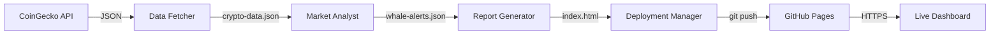

# 🌊 24/7 Crypto Watchtower

> **Autonomous cryptocurrency monitoring system** that detects whale movements and deploys live dashboards—powered by GitHub Copilot CLI agents.

[](https://etlee.github.io/stock-website)
[](https://github.com/etlee/stock-website/actions)
[](https://etlee.github.io/stock-website)

##  What It Does

This project monitors the **top 20 cryptocurrencies** in real-time and:

- 📊 **Fetches** live market data from CoinGecko API every 15 minutes
- 🐋 **Detects** whale movements (price changes > 5% in 15 min)
- 📈 **Generates** interactive Chart.js dashboards
- 🚀 **Deploys** automatically to GitHub Pages
- 🤖 **Runs autonomously** with GitHub Actions—no manual intervention

## 🎯 Features

### Whale Detection
- **Medium** 🟡: 5-10% price change
- **High** 🟠: 10-20% price change  
- **Critical** 🔴: >20% price change

### Visualizations
- Line chart: Price trends for top 20 coins
- Bar chart: 24-hour trading volumes
- Horizontal bar: Market cap comparison (top 10)
- Responsive design: Works on mobile, tablet, desktop

### Automation
- Scheduled execution every 15 minutes
- Automatic git commits and deployments
- Self-healing error recovery
- Comprehensive logging

## 🏗️ System Architecture

```
┌─────────────────────┐
│  GitHub Actions     │  Triggers every 15 min
│  (Scheduler)        │
└──────────┬──────────┘
           │
           ▼
┌─────────────────────┐
│  Data Fetcher       │  CoinGecko API → JSON
│  Agent              │
└──────────┬──────────┘
           │
           ▼
┌─────────────────────┐
│  Market Analyst     │  Detect whale movements
│  Agent              │
└──────────┬──────────┘
           │
           ▼
┌─────────────────────┐
│  Report Generator   │  Chart.js dashboard
│  Agent              │
└──────────┬──────────┘
           │
           ▼
┌─────────────────────┐
│  Deployment Manager │  GitHub Pages
│  Agent              │
└──────────┬──────────┘
           │
           ▼
        🌐 LIVE!
```

## 📁 Project Structure

```
Stock-Website/
├── .github/
│   ├── agents/                    # Custom Copilot agents
│   │   ├── data-fetcher.agent.md
│   │   ├── market-analyst.agent.md
│   │   ├── report-generator.agent.md
│   │   └── deployment-manager.agent.md
│   │
│   ├── skills/                    # Reusable capabilities
│   │   ├── fetch-crypto-data.skill.md
│   │   ├── detect-volatility.skill.md
│   │   ├── generate-charts.skill.md
│   │   └── deploy-github-pages.skill.md
│   │
│   ├── prompts/                   # Coordination templates
│   │   ├── data-pipeline-orchestration.prompt.md
│   │   ├── whale-alert-format.prompt.md
│   │   └── dashboard-layout.prompt.md
│   │
│   ├── instructions/              # Coding standards
│   │   ├── coding-style.md
│   │   ├── html-standards.md
│   │   └── agent-interaction.md
│   │
│   └── workflows/                 # GitHub Actions
│       ├── crypto-watchtower.yml
│       ├── PAGES-SETUP.md
│       └── API-SECRETS.md
│
├── data/                          # Generated data files
│   ├── crypto-data.json           # Current snapshot
│   ├── crypto-data-previous.json  # Previous snapshot
│   └── whale-alerts.json          # Detected movements
│
├── docs/                          # Published to GitHub Pages
│   ├── index.html                 # Dashboard
│   └── data/                      # Public data access
│       ├── crypto-data.json
│       └── whale-alerts.json
│
├── logs/                          # Execution logs
│   ├── data-fetcher.log
│   ├── market-analyst.log
│   ├── report-generator.log
│   └── deployment-manager.log
│
└── README.md                      # You are here
```

## 🚀 Quick Start

### Prerequisites
- GitHub account
- Repository: `etlee/stock-website`
- GitHub Pages enabled

### Setup (5 minutes)

1. **Enable GitHub Pages**
   ```
   Repository Settings → Pages
   Source: main branch, /docs folder
   Save
   ```

2. **Configure Workflow Permissions**
   ```
   Repository Settings → Actions → General
   Workflow permissions: Read and write
   Save
   ```

3. **Trigger First Run**
   ```
   Actions tab → Crypto Watchtower Pipeline → Run workflow
   ```

4. **View Dashboard**
   ```
   https://etlee.github.io/stock-website
   ```

That's it! The system now runs automatically every 15 minutes.

## 🛠️ How It Works

### Agent-Based Architecture

This project uses **GitHub Copilot CLI Custom Agents** to orchestrate the pipeline. Each agent is a specialized markdown file with YAML front matter defining its capabilities.

#### 1. Data Fetcher Agent
- **File**: `.github/agents/data-fetcher.agent.md`
- **Purpose**: Fetch top 20 cryptocurrencies from CoinGecko
- **Output**: `data/crypto-data.json`
- **Skills**: API integration, error handling, rate limiting

#### 2. Market Analyst Agent
- **File**: `.github/agents/market-analyst.agent.md`
- **Purpose**: Detect whale movements by comparing snapshots
- **Input**: Current + previous data
- **Output**: `data/whale-alerts.json`
- **Algorithm**: `((current - previous) / previous) * 100 > 5%`

#### 3. Report Generator Agent
- **File**: `.github/agents/report-generator.agent.md`
- **Purpose**: Create interactive Chart.js dashboard
- **Input**: Crypto data + whale alerts
- **Output**: `docs/index.html`
- **Features**: Responsive, auto-refresh, dark theme

#### 4. Deployment Manager Agent
- **File**: `.github/agents/deployment-manager.agent.md`
- **Purpose**: Commit and push to GitHub Pages
- **Actions**: Git commit, push, verify deployment
- **Output**: Live site at GitHub Pages URL

### Skills (Reusable Capabilities)

Skills are modular functions that agents can use:
- `fetch-crypto-data.skill.md`: CoinGecko API integration
- `detect-volatility.skill.md`: Price change algorithms
- `generate-charts.skill.md`: Chart.js visualization patterns
- `deploy-github-pages.skill.md`: Git deployment procedures

### Data Flow



## 📊 Dashboard Features

### Live Metrics
- **Price Overview**: Line chart showing all 20 cryptocurrencies
- **Trading Volume**: Bar chart of 24-hour volumes
- **Market Cap**: Top 10 cryptocurrencies by market cap
- **Whale Alerts**: Table of significant price movements

### Interactive Charts
- Hover tooltips with detailed info
- Color-coded by price direction (green ▲, red ▼)
- Responsive scaling for mobile devices
- Auto-refresh every 15 minutes

### Whale Alert Table
| Crypto | Change | Previous | Current | Severity |
|--------|--------|----------|---------|----------|
| Bitcoin (BTC) | +7.5% | $45,000 | $48,375 | 🟠 HIGH |

## ⚙️ Configuration

### Monitoring Scope
Edit in workflow to change coin count:
```yaml
per_page=20  # Change to 50, 100, etc.
```

### Update Frequency
Edit cron schedule:
```yaml
schedule:
  - cron: '*/15 * * * *'  # Every 15 minutes
  # - cron: '0 * * * *'   # Every hour
  # - cron: '*/5 * * * *'  # Every 5 minutes
```

### Whale Threshold
Edit in Market Analyst:
```python
if abs(change_percent) > 5:  # Change to 3, 10, etc.
```

### Visualization Theme
Edit CSS in `docs/index.html`:
```css
--bg-primary: #1a1a2e;  /* Dark theme */
--accent: #00d4ff;      /* Blue accent */
```

## 🧪 Testing

### Manual Run
```bash
# Trigger workflow manually
gh workflow run crypto-watchtower.yml

# View logs
gh run view --log
```

### Local Testing
```bash
# Test data fetcher
curl "https://api.coingecko.com/api/v3/coins/markets?..." | jq

# Test Python analysis
python3 test-analyst.py

# Test dashboard locally
cd docs && python3 -m http.server 8000
open http://localhost:8000
```

### Validation
```bash
# Check JSON validity
jq '.' data/crypto-data.json

# Verify HTML
htmlhint docs/index.html

# Test live site
curl -I https://etlee.github.io/stock-website
```

## 🔧 Troubleshooting

### Dashboard Not Updating

**Symptom**: Old data showing on live site

**Solutions**:
1. Check Actions tab for workflow errors
2. Clear browser cache: `Ctrl+Shift+R`
3. Verify GitHub Pages is enabled
4. Check workflow permissions (write access)

### API Rate Limiting

**Symptom**: Workflow fails with 429 errors

**Solutions**:
1. Reduce frequency (30 min instead of 15 min)
2. Add CoinGecko API key (see `.github/workflows/API-SECRETS.md`)
3. Implement longer retry delays

### Git Push Failures

**Symptom**: Deployment step fails

**Solutions**:
1. Check workflow has write permissions
2. Verify Git is configured correctly
3. Check for merge conflicts
4. Review deployment logs

See [Full Troubleshooting Guide](.github/workflows/TROUBLESHOOTING.md) for more details.

## 📈 Performance

### Metrics
- **API Response Time**: ~500ms average
- **Analysis Time**: <100ms for 20 coins
- **Dashboard Generation**: ~200ms
- **Deployment Time**: ~5-10 seconds
- **Total Pipeline**: ~15 seconds end-to-end

### Resource Usage
- **API Calls**: 96 per day (well within free tier)
- **GitHub Actions Minutes**: ~5 minutes per day
- **Storage**: <5 MB (data + logs)
- **Bandwidth**: ~100 MB per month (estimated)

## 🛡️ Security

### Data Privacy
- ✅ All data is public market information
- ✅ No personal data collected
- ✅ No user authentication required
- ✅ GDPR compliant

### API Keys
- ✅ CoinGecko free tier requires no API key
- ✅ GitHub token auto-provided by Actions
- ✅ No secrets needed for basic operation

### Best Practices
- Never commit API keys
- Use GitHub Secrets for sensitive data
- Rotate tokens every 90 days
- Monitor for unauthorized access

## 🎓 Learning Resources

### Agent Development
- [GitHub Copilot CLI Docs](https://code.visualstudio.com/docs/copilot/cli)
- [Custom Agents Guide](https://code.visualstudio.com/docs/copilot/customization/custom-agents)
- Agent examples in `.github/agents/`

### API Integration
- [CoinGecko API Docs](https://www.coingecko.com/en/api/documentation)
- [GitHub Actions Docs](https://docs.github.com/en/actions)
- [GitHub Pages Docs](https://docs.github.com/en/pages)

### Visualization
- [Chart.js Documentation](https://www.chartjs.org/docs/)
- [Responsive Design Guide](https://developer.mozilla.org/en-US/docs/Learn/CSS/CSS_layout/Responsive_Design)

## 🤝 Contributing

This is a personal project, but feel free to fork and customize!

### Customization Ideas
- Add more cryptocurrencies (top 50, 100)
- Historical price charts (24h trends)
- Email/SMS alerts for critical movements
- Telegram/Discord bot integration
- Portfolio tracking features
- Sentiment analysis from social media

## 📝 License

This project is open source and available under the MIT License.

### Attribution
- Data: [CoinGecko API](https://www.coingecko.com/)
- Charts: [Chart.js](https://www.chartjs.org/)
- Hosting: [GitHub Pages](https://pages.github.com/)
- Automation: [GitHub Actions](https://github.com/features/actions)

## 🌟 Acknowledgments

Built with:
- **GitHub Copilot CLI** - AI-powered agent orchestration
- **CoinGecko** - Cryptocurrency market data
- **Chart.js** - Beautiful JavaScript charts
- **GitHub Pages** - Free static hosting
- **GitHub Actions** - CI/CD automation

## 📬 Contact

- **Repository**: https://github.com/etlee/stock-website
- **Live Dashboard**: https://etlee.github.io/stock-website
- **Issues**: https://github.com/etlee/stock-website/issues

---

<p align="center">
  <strong>🌊 Built with GitHub Copilot CLI | Updates Every 15 Minutes | 100% Autonomous 🤖</strong>
</p>

<p align="center">
  <a href="https://etlee.github.io/stock-website">View Live Dashboard →</a>
</p>
